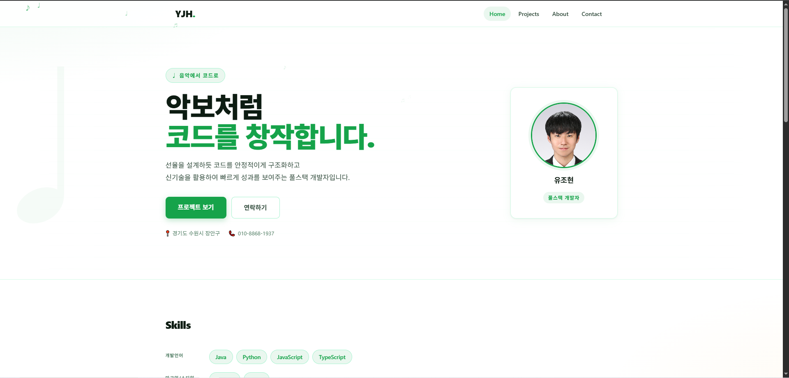
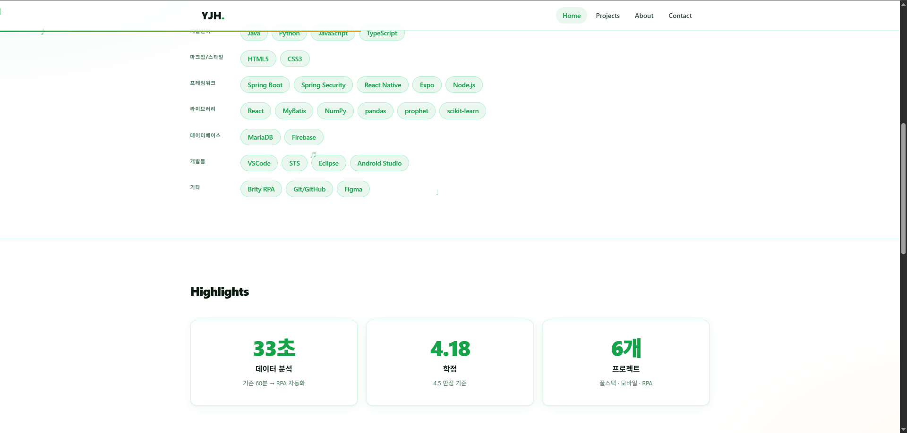
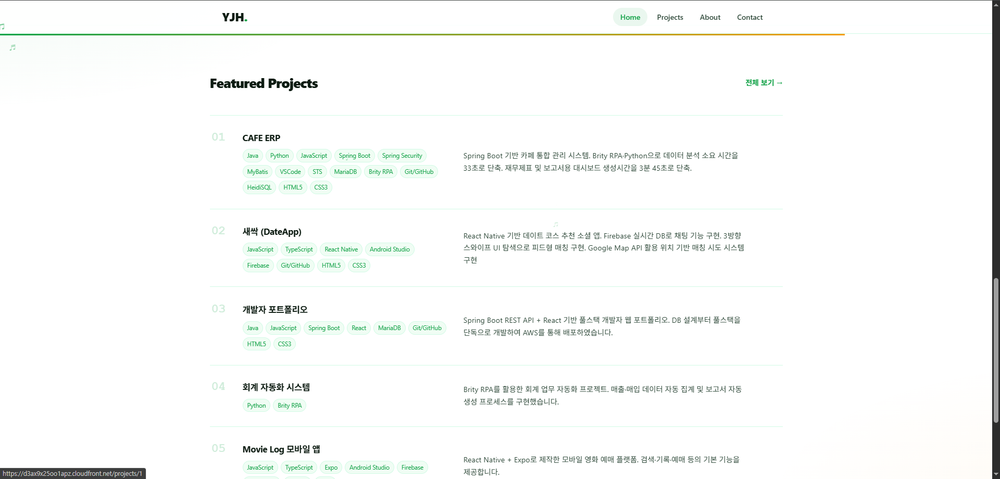
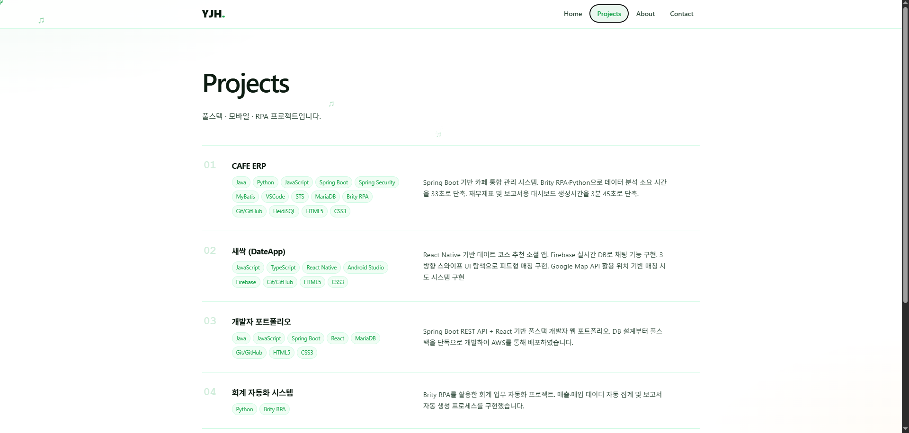
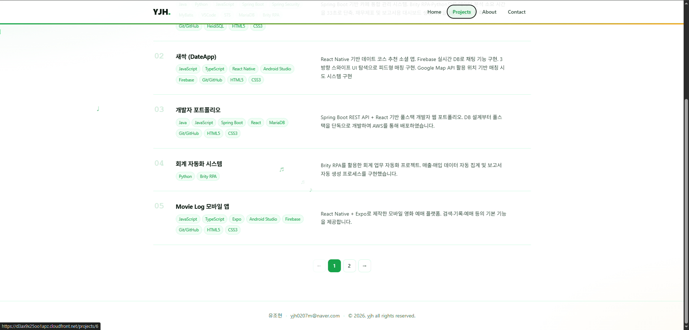
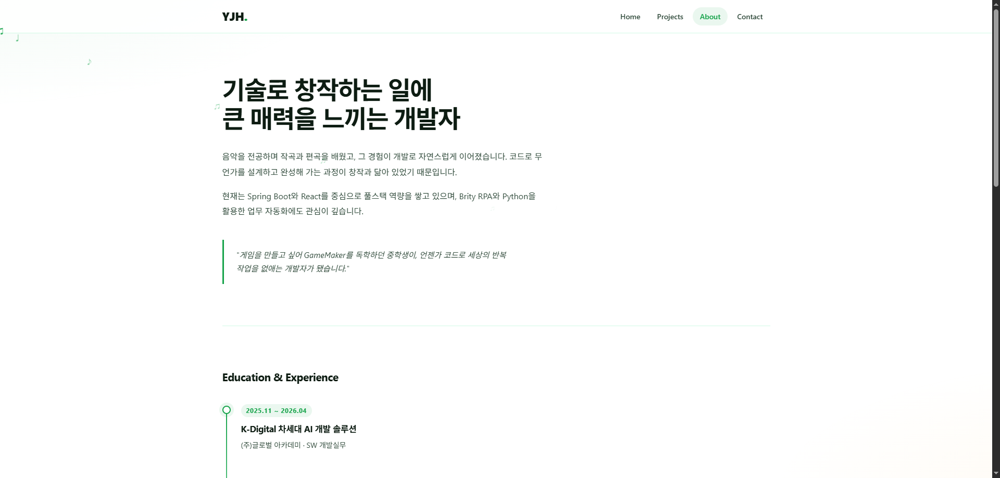
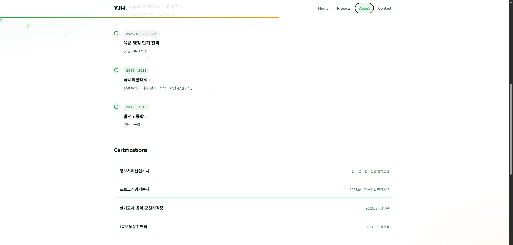
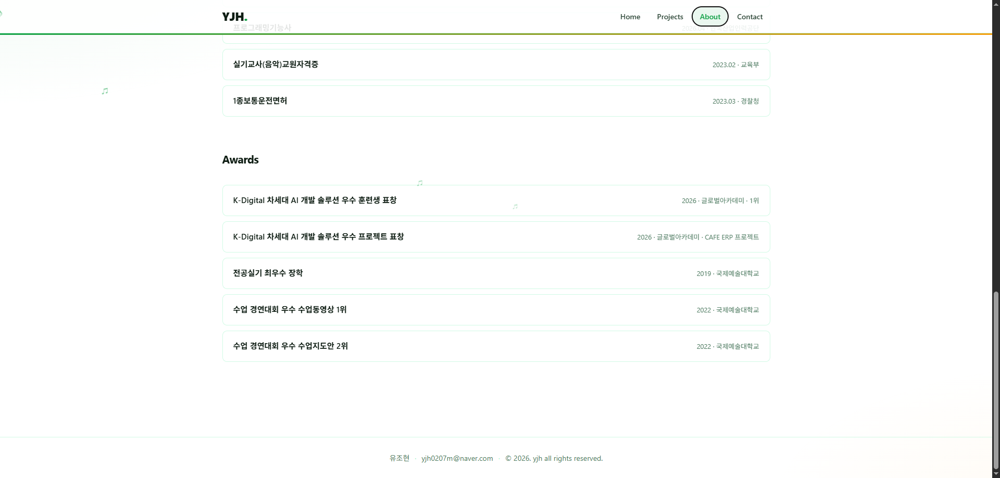
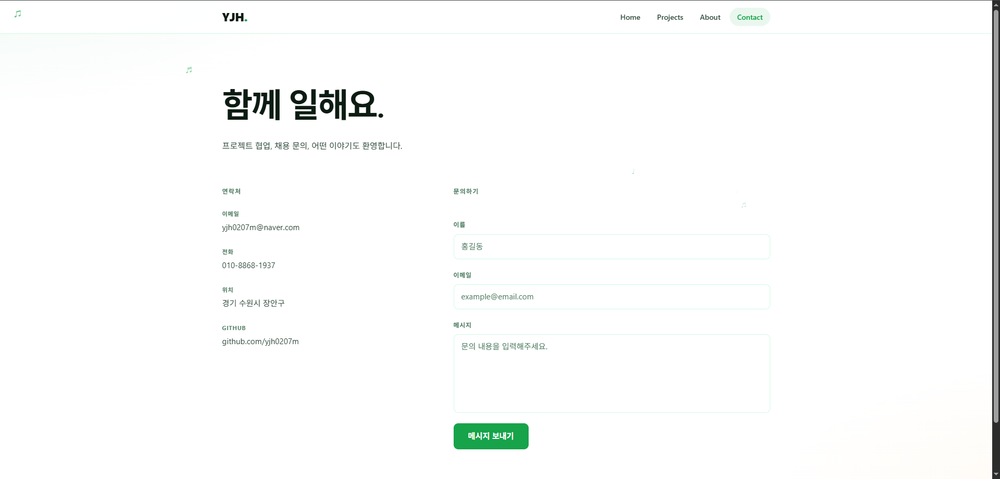

# 유조현 개발자 포트폴리오

풀스택 개발자 유조현의 개인 포트폴리오 웹사이트입니다.  
프로젝트 경험, 기술 스택, 이력 정보를 한곳에서 확인할 수 있습니다.

---

## 목차

- [스크린샷](#스크린샷)
- [기술 스택](#기술-스택)
- [프로젝트 구조](#프로젝트-구조)
- [로컬 실행 방법](#로컬-실행-방법)
- [페이지 구성](#페이지-구성)
- [API 엔드포인트](#api-엔드포인트)
- [Contact](#contact)

---

## 스크린샷

### Home
| |
|---|
|  |

| | |
|---|---|
|  |  |

### Projects
| | |
|---|---|
|  |  |

### About
| | | |
|---|---|---|
|  |  |  |

### Contact
| |
|---|
|  |

---

## 기술 스택

### Frontend
| 분류 | 기술 |
|---|---|
| Framework | React 19 |
| Routing | React Router DOM 7 |
| Build Tool | Vite 8 |
| Email | EmailJS |
| Language | JavaScript (ES Module) |

### Backend
| 분류 | 기술 |
|---|---|
| Framework | Spring Boot 4.0 |
| Language | Java 17 |
| ORM | Spring Data JPA |
| Database | MariaDB |
| API Docs | SpringDoc OpenAPI (Swagger) |

---

## 프로젝트 구조

```
YJH---Developer-Portfolio-/
├── portfolio-front/          # React + Vite 프론트엔드
│   ├── public/
│   │   ├── image/            # 스크린샷 이미지
│   │   ├── ppt/              # PDF 발표자료
│   │   ├── code.png          # 파비콘 소스
│   │   └── profile.jpg       # 프로필 이미지
│   └── src/
│       ├── api/              # API 호출 모듈
│       ├── assets/           # 정적 에셋
│       ├── components/
│       │   ├── common/       # 공통 컴포넌트 (Nav, Footer 등)
│       │   └── projects/     # 프로젝트 전용 컴포넌트
│       ├── constants/        # 상수 정의
│       ├── hooks/            # 커스텀 훅 (useFetch, useInView 등)
│       ├── pages/            # 페이지 컴포넌트
│       ├── styles/           # 전역 CSS
│       ├── App.jsx
│       └── main.jsx
│
├── portfolio-back/           # Spring Boot 백엔드
│   └── src/main/
│       ├── java/com/yjh/portfolio/
│       │   ├── config/       # CORS 설정
│       │   ├── controller/   # REST API 컨트롤러
│       │   ├── dto/          # 응답 DTO (record)
│       │   ├── entity/       # JPA 엔티티
│       │   ├── repository/   # Spring Data Repository
│       │   └── service/      # 비즈니스 로직
│       └── resources/
│           ├── application.properties
│           ├── application-local.properties
│           ├── schema.sql    # 테이블 DDL
│           └── data.sql      # 시드 데이터
│
├── README.md
└── REQUIREMENTS.md
```

---

## 로컬 실행 방법

### 사전 요구사항
- Java 17+
- Node.js 18+
- MariaDB (로컬 또는 원격)

### 1. 데이터베이스 준비

MariaDB에 `portfolio` 스키마를 생성합니다.

```sql
CREATE DATABASE portfolio CHARACTER SET utf8mb4 COLLATE utf8mb4_unicode_ci;
```

### 2. 백엔드 실행

`application.properties`의 DB 접속 정보를 환경에 맞게 수정합니다.

```properties
spring.datasource.url=jdbc:mariadb://localhost:3306/portfolio
spring.datasource.username=root
spring.datasource.password=(비밀번호)
```

> 최초 실행 시 `spring.sql.init.mode=always`로 변경하면 schema.sql → data.sql 순서로 자동 실행됩니다. 이후 `never`로 되돌리세요.

STS 또는 Maven으로 실행합니다.

```bash
cd portfolio-back
./mvnw spring-boot:run
```

### 3. 프론트엔드 실행

```bash
cd portfolio-front
npm install
npm run dev
```

브라우저에서 `http://localhost:5173` 접속.

> Vite 개발 서버의 프록시 설정으로 `/api` 요청이 `localhost:8080`으로 자동 전달됩니다.

---

## 페이지 구성

| 경로 | 페이지 | 설명 |
|---|---|---|
| `/` | Home | 히어로, 프로젝트, 스킬, 하이라이트 |
| `/about` | About | 이력서 (학력, 병역, 자격증, 수상) |
| `/projects` | Projects | 프로젝트 카드 목록 |
| `/projects/:id` | ProjectDetail | 기술스택, 성과지표, 느낀 점, PDF |
| `/contact` | Contact | EmailJS 기반 이메일 폼 |

---

## API 엔드포인트

| Method | URL | 설명 |
|---|---|---|
| GET | `/api/profile` | 기본 프로필 정보 |
| GET | `/api/resume` | 학력 · 병역 · 자격증 · 교육 · 수상 |
| GET | `/api/skills` | 기술 스택 목록 |
| GET | `/api/highlights` | 홈 Highlights 카드 |
| GET | `/api/projects` | 프로젝트 목록 |
| GET | `/api/projects/{id}` | 프로젝트 상세 |

Swagger UI: `http://localhost:8080/swagger-ui/index.html`

---

## Contact

- GitHub: [https://github.com/yjh0207m](https://github.com/yjh0207m)
- Email: yjh0207m@naver.com
